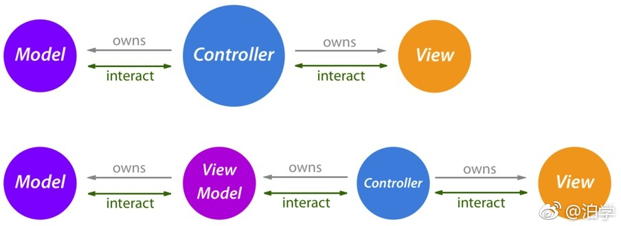

# MVC

- Model：用来存放数据
- View：用来展示数据，交互和动画
- Controller：作为View和Model直接的连接，负责管理视图、数据请求、业务逻辑、装配View等业务

# MVVM

- Model：用来存放数据
- View：用来展示数据，交互和动画
- ViewModel：作为View和Model直接的连接，负责数据请求、业务逻辑、装配View等业务
- ViewController：负责管理视图

# MVVM+RXSwift
